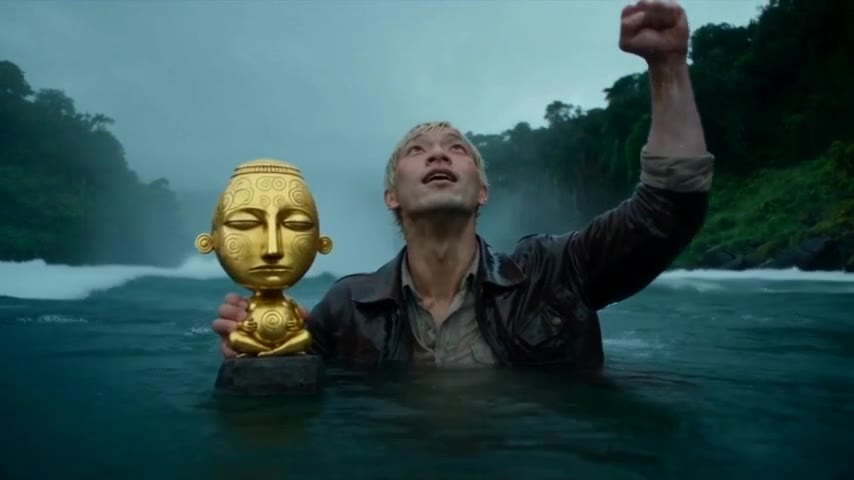

# raider-of-lost-art

**"The Idol That Wakes"** is a 36-second AI-generated adventure short. A fictional explorer takes a small gold idol from a temple altar, flees along a cliff, jumps into a waterfall and survives. At the last moment the idol wakes. The film has no dialogue. The video model generated the sound. The ending is not made yet.

## Watch it

- **Play in the browser:** <https://az9713.github.io/raider-of-lost-art/> (click the picture above).
- **Direct file:** [`docs/film.mp4`](docs/film.mp4) (854x480, 24 fps, 36.25 s, about 9 MB). GitHub plays it inline on that page.

## Read how it was made

- **Development journey, warts and all:** [`DEVELOPMENT-JOURNEY.md`](DEVELOPMENT-JOURNEY.md), or the [web version](https://az9713.github.io/raider-of-lost-art/journey.html). It covers the decisions, the sharp turns, the clips that went wrong, the pixel repairs, which model made which clip, and the credit top-ups, including the two-wallet confusion.

## What is in this repository

| Path | What it is |
|---|---|
| `docs/` | The GitHub Pages site: `index.html` (player), `journey.html`, `film.mp4`, `poster.jpg`, `img/` |
| `DEVELOPMENT-JOURNEY.md` | The full journey in Markdown |
| `prompts/` | Every prompt version for the shots, in the structure taught by the course (shot 2 has seven versions) |
| `tools/run_api.py` | Runner for the Seedance 2.0 reference-to-video API. It reads keys from a local `.env`. No keys are committed. |
| `tools/make_stitch.sh` | The ffmpeg script that joins the five clips |
| `tools/repaint2.py`, `mouthtrack.py`, `mouthedit2.py` | The OpenCV scripts for the satchel repaint and the idol teeth edit. They are written for one clip at 864x496 and will not transfer as they are. |
| `tools/build_html.py` | Builds `docs/journey.html` from the Markdown |

## Tools and models

Claude Code (Claude Sonnet 5.5 in the last session), Higgsfield (Seedance 2.5 through the CLI, Seedance 2.0 through the API, GPT Image 2.5 and Soul Location for stills), Python with OpenCV and NumPy, and ffmpeg.

## Not included, on purpose

The reference photos used to create the hero, the prompt that created the hero, the generated character sheets, the individual raw clips, account details and keys.

## Status

Editing is paused at 36.25 s of a planned 45 s.
